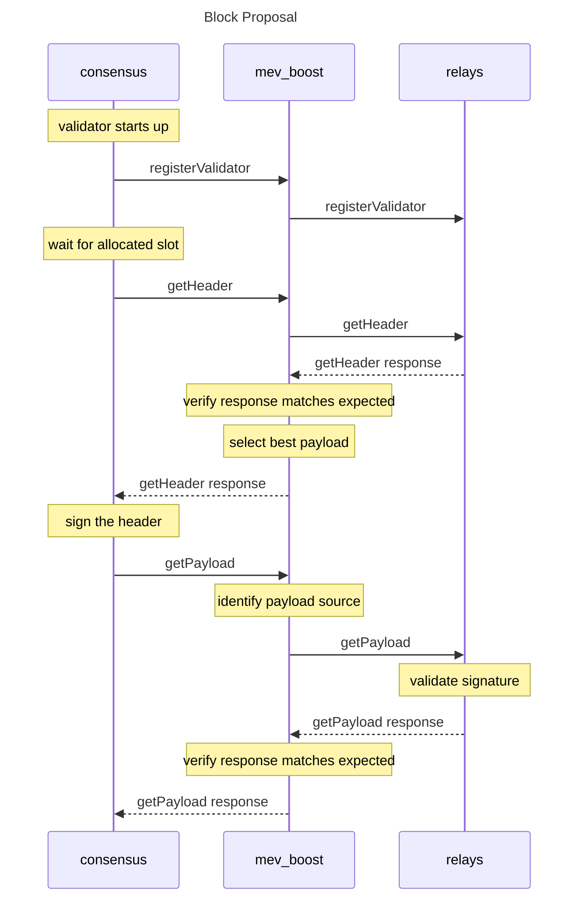

# mev-bot

A service that allows Ethereum Consensus Layer (CL) clients to outsource block construction to third party block builders in addition to execution clients.

### Request sequence



## Build

```
make build
```

and then run it with:

```
./mev-bot
```

## Lint & Test

```
make test
make lint
make run-mergemock-integration
```

The path to the mergemock repo is assumed to be `../mergemock`, you can override like so:

```
make MERGEMOCK_DIR=/PATH-TO-MERGEMOCK-REPO run-mergemock-integration
```

to run mergemock in dev mode:

```
make MERGEMOCK_BIN='go run .' run-mergemock-integration
```

## Testing with test-cli

[test-cli readme](cmd/test-cli/README.md)
